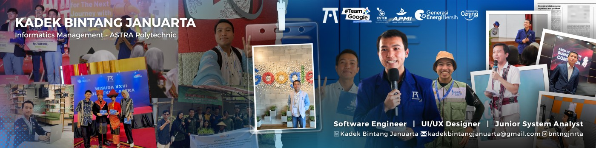

<h2>👋 Hello World!</h2>

<p>
I'm <strong>Kadek Bintang Januarta</strong>, an Informatics Management student at <strong>ASTRA Polytechnic</strong> with a strong passion for <strong>software engineering, full-stack development, and system analysis</strong>. I build web, mobile, and desktop applications with a focus on scalable architecture, efficient systems, and user-centered solutions. I'm also interested in <strong>Artificial Intelligence, Machine Learning, system architecture, and digital innovation</strong>. Beyond software development, I actively participate in technology competitions, research projects, organizational activities, and community initiatives.</p>

```javascript
const bintang = {
  role              : "Informatics Management Student",
  education         : "ASTRA Polytechnic",
  currentGPA        : "3.96 / 4.00",
  estimatedGraduate : "2027",

  interests : [
    "Software Engineering",
    "Full-Stack Development",
    "System Analysis",
    "Artificial Intelligence",
    "Machine Learning"
  ],

  focus : [
    "Web Systems",
    "Enterprise Applications",
    "AI Integration",
    "Digital Innovation"
  ]
};
```

---

<h2>💻 Languages & Tools</h2>

<p>
I work across the application stack, from responsive user interfaces and backend
services to databases, APIs, system analysis, and network infrastructure.
</p>

<details open>
<summary><b>Frontend Development</b></summary>
<br>

<p align="center">
  
</p>

<p align="center">
  <code>React.js</code>
  <code>Next.js</code>
  <code>JavaScript</code>
  <code>TypeScript</code>
  <code>HTML5</code>
  <code>CSS3</code>
  <code>Tailwind CSS</code>
  <code>Bootstrap</code>
  <code>AJAX</code>
  <code>Responsive Web Design</code>
</p>

</details>

<details>
<summary><b>Backend Development</b></summary>
<br>

<p align="center">
  
</p>

<p align="center">
  <code>C#</code>
  <code>ASP.NET Core</code>
  <code>PHP</code>
  <code>Laravel</code>
  <code>Java</code>
  <code>Spring Boot</code>
  <code>RESTful API</code>
  <code>Dapper</code>
  <code>Entity Framework</code>
  <code>JWT</code>
</p>

</details>

<details>
<summary><b>Database</b></summary>
<br>

<p align="center">
  
  
  
</p>

<p align="center">
  <code>Microsoft SQL Server</code>
  <code>MySQL</code>
  <code>Oracle Database</code>
</p>

</details>

<details>
<summary><b>Tools & Development</b></summary>
<br>

<p align="center">
  
</p>

<p align="center">
  
  
  
  
</p>

<p align="center">
  <code>Git</code>
  <code>GitHub</code>
  <code>Postman</code>
  <code>Swagger</code>
  <code>Docker</code>
  <code>Power BI</code>
  <code>Figma</code>
  <code>Microsoft Visio</code>
  <code>Microsoft Office</code>
</p>

</details>

<details>
<summary><b>Network Infrastructure</b></summary>
<br>

<p align="center">
  
  
  
  
</p>

<p align="center">
  <code>MikroTik</code>
  <code>Cisco</code>
  <code>Ruijie</code>
  <code>DNS Management</code>
  <code>Windows Server Administration</code>
  <code>VLAN</code>
</p>

</details>

---

<h2>🚀 Featured Projects</h2>

<table width="100%">
<tr>
<td width="50%" valign="top">

<h3>🎓 Academic Information System</h3>
<p>Academic information system for <strong>ASTRA Polytechnic</strong>.</p>
<p>
  <code>Next.js</code>
  <code>ASP.NET Core</code>
  <code>SQL Server</code>
</p>

</td>
<td width="50%" valign="top">

<h3>📦 Asset Management System</h3>
<p>Asset management information system for <strong>UPT Informatics ASTRA Polytechnic</strong>.</p>
<p>
  <code>PHP</code>
  <code>CodeIgniter 3</code>
  <code>MySQL</code>
</p>

</td>
</tr>

<tr>
<td width="50%" valign="top">

<h3>👥 Employee Recruitment System</h3>
<p>Employee recruitment system developed for <strong>PT GS Battery</strong>.</p>
<p>
  <code>C#</code>
  <code>DevExpress</code>
  <code>SQL Server</code>
</p>

</td>
<td width="50%" valign="top">

<h3>🌐 Cening Community</h3>
<p>Company profile website for <strong>Cening Community</strong>.</p>
<p>
  <code>React.js</code>
  <code>Tailwind CSS</code>
</p>

</td>
</tr>

<tr>
<td width="50%" valign="top">

<h3>🤖 Mentora AI</h3>
<p>Mobile-based AI learning assistant implementing <strong>Retrieval-Augmented Generation (RAG)</strong> for Informatics Management students.</p>
<p>
  <code>React Native</code>
  <code>Expo</code>
  <code>RAG</code>
  <code>AI</code>
</p>

</td>
<td width="50%" valign="top">

<h3>💧 Solar-Powered Water Purification</h3>
<p>Arduino and solar panel-based water purification system for treating contaminated water.</p>
<p>
  <code>Arduino</code>
  <code>Solar Panel</code>
  <code>IoT</code>
</p>

</td>
</tr>
</table>

---

<h2>🔬 Research</h2>

<ul>
<li><strong>Sentiment Analysis and Clustering of Vocational Education Selection with Machine Learning</strong></li>
<li><strong>Development of an Efficient and Interpretable Dermoscopic Image-Based Melanoma Detection Model Using Explainable Artificial Intelligence</strong></li>
<li><strong>Mentora AI: Implementation of Retrieval-Augmented Generation in a Mobile-Based AI Learning Assistant for Informatics Management Students</strong></li>
<li><strong>Utilization of Mackerel Tuna Bone Waste as Activated Carbon Electrode Material for Electric Double-Layer Capacitors</strong></li>
<li><strong>Arduino and Solar-Powered Water Purification System for Treating Contaminated Water</strong></li>
</ul>

---

<h2>🎓 Education</h2>

<details open>
<summary><b>ASTRA Polytechnic</b></summary>
<br>

<ul>
  <li><strong>Program:</strong> Informatics Management</li>
  <li><strong>Location:</strong> Cikarang, Jawa Barat</li>
  <li><strong>Period:</strong> August 2024 – Present</li>
  <li><strong>Current GPA:</strong> 3.96 / 4.00</li>
  <li><strong>Estimated Graduation:</strong> 2027</li>
  <li><strong>Achievement:</strong> ASTRA Scholarship Awardee</li>
</ul>

</details>

<details>
<summary><b>SMA Negeri Bali Mandara</b></summary>
<br>

<ul>
  <li><strong>Program:</strong> Mathematics and Natural Sciences</li>
  <li><strong>Location:</strong> Buleleng, Bali</li>
  <li><strong>Period:</strong> July 2021 – April 2024</li>
  <li><strong>Achievement:</strong> Graduate with Best Research Award</li>
</ul>

</details>

---

<h2>🏆 Awards & Achievements</h2>

<table width="100%">
<tr>
<td width="50%" valign="top">

<h3>🌐 Google Student Ambassador</h3>
<p><strong>Google Indonesia</strong> · Apr 2026<br>Selected to be one of two thousand GSAs throughout Indonesia</p>

</td>
<td width="50%" valign="top">

<h3>🌟 KPP Youth In Action 2</h3>
<p><strong>PT Kalimantan Prima Persada</strong> · Aug 2026<br>Recipients of social project grant funds</p>

</td>
</tr>

<tr>
<td width="50%" valign="top">

<h3>🏆 1st International Conference on Data Science and Geoinformatics (ICDSG)</h3>
<p><strong>INABIMS Center</strong> · Nov 2025<br>Best paper awardee</p>

</td>
<td width="50%" valign="top">

<h3>🏅 AHM GEAR Business Case Competition</h3>
<p><strong>PT Astra Honda Motor</strong> · Nov 2025<br>National finalist</p>

</td>
</tr>

<tr>
<td width="50%" valign="top">

<h3>🌱 West Java Renewable Energy Exploration</h3>
<p><strong>Institute for Essential Services Reform (IESR)</strong> · Jan 2024<br>Delegated from Bali Province for the renewable energy exploration event</p>

</td>
<td width="50%" valign="top">

<h3>🥈 Astra Honda Motor Best Student</h3>
<p><strong>PT Astra Honda Motor</strong> · Nov 2023<br>Silver medal in the invention category</p>

</td>
</tr>

<tr>
<td width="50%" valign="top">

<h3>🥈 Festival of Innovation and Student Entrepreneurship in Indonesia</h3>
<p><strong>Kemendikbudristek, Puspresnas</strong> · Sept 2023<br>Silver medal in advanced business cultivation and cross-sector collaboration</p>

</td>
<td width="50%" valign="top">

<h3>🚀 INCUBITS (WASH Innovation Hub Start-Up Incubator)</h3>
<p><strong>UNICEF, Kementerian PUPR</strong> · Feb 2023<br>National grand finalist</p>

</td>
</tr>

<tr>
<td width="50%" valign="top">

<h3>🥈 The 10th Ambassador Business Edupreneur</h3>
<p><strong>Universitas Pendidikan Indonesia</strong> · Nov 2022<br>2nd place in the start-up business category</p>

</td>
<td width="50%" valign="top">

<h3>🥇 Digital Innovation and Technology Competition</h3>
<p><strong>PT Astra International Tbk</strong> · Jan 2022<br>1st place in the future of mobility category</p>

</td>
</tr>
</table>

---

<h2>🤝 Organizational Experience</h2>

<details open>
<summary><b>Google | Google Student Ambassador</b></summary>
<br>

<p>📅 <strong>Apr 2026 – Present</strong></p>
<p>Represented Google on campus by promoting its technologies, programs, and initiatives to fellow students, organizing events and workshops to increase engagement with Google products while building leadership, communication, and digital marketing skills.</p>

</details>

<details>
<summary><b>ASEEC Education | Marketing Team</b></summary>
<br>

<p>📅 <strong>Jun 2025 – Present</strong></p>
<p>Served as Creative Content Specialist, crafting content strategies to boost audience reach and engagement across social media platforms, contributing to ASEEC's educational video productions, and managing the organization's official LinkedIn presence.</p>

</details>

<details>
<summary><b>BEM Politeknik Astra | Secretary</b></summary>
<br>

<p>📅 <strong>Mar 2025 – Jun 2026</strong></p>
<p>Managed organizational administration, documentation, and internal-external communication, including meeting minutes, official archives, event scheduling, and accountability reports, while supporting student-centered program planning and execution.</p>

</details>

<details>
<summary><b>Asosiasi Peneliti Muda Indonesia | Entrepreneurship Division</b></summary>
<br>

<p>📅 <strong>Apr 2024 – Apr 2026</strong></p>
<p>Delivered training on scientific writing, Mendeley reference management, and SPSS data analysis, and mentored multiple teams for FIKSI 2024 and the Astra Honda Motor Best Student competition while co-developing entrepreneurship training programs for internal and external partners.</p>

</details>

<details>
<summary><b>Generasi Energi Bersih | Bali Regional Administrator</b></summary>
<br>

<p>📅 <strong>Dec 2023 – Dec 2025</strong></p>
<p>Designed and implemented renewable energy awareness programs for the Bali community, organized seminars and webinars on clean energy, and represented Bali in the West Java Renewable Energy Exploration 2024, visiting facilities such as Pertamina Geothermal Energy and the Cirata Floating Solar Power Plant.</p>

</details>

<details>
<summary><b>Astra Polytechnic | Innovation Division, ASTRA Polytechnic Dormitory</b></summary>
<br>

<p>📅 <strong>Oct 2024 – Aug 2025</strong></p>
<p>Identified improvement opportunities within the dormitory management system and proposed technology-driven, sustainable solutions, including IoT-based facility monitoring, in collaboration with residents, staff, and dormitory management.</p>

</details>

<details>
<summary><b>KSTEB | Program Officer & Social Media Officer</b></summary>
<br>

<p>📅 <strong>Aug 2024 – Aug 2025</strong></p>
<p>Designed and managed business mentoring programs to support clean energy startup growth, engaged in government-organized events for networking and collaboration, and oversaw KSTEB's social media platforms to raise public awareness of sustainable energy.</p>

</details>

<details>
<summary><b>OSIS SMA Negeri Bali Mandara | Information and Communication Department</b></summary>
<br>

<p>📅 <strong>Jul 2021 – Jul 2022</strong></p>
<p>Managed organizational communication, created digital content, and documented school activities, collaborating with cross-functional committees to organize events and ensure effective communication between the student council, administration, and students.</p>

</details>

---

<h2>📜 Licenses & Certifications</h2>

<p>
  
  
  
</p>

<p>
  
  
  
</p>

---

<h2>🧠 Soft Skills</h2>

<p>
  
  
  
  
  
  
  
</p>

---

<h2>Let's Connect</h2>

<p>
Feel free to reach out if you'd like to collaborate on a project,
technology research, software development, or innovation initiatives.
</p>

<p>
  <a href="mailto:kadekbintangjanuarta@gmail.com">
    
  </a>
  <a href="https://www.linkedin.com/in/kadek-bintang-januarta">
    
  </a>
  <a href="https://bintangportofolio.vercel.app">
    
  </a>
</p>

<p align="center">
  <i>Building technology, creating impact, and continuously learning.</i>
</p>
